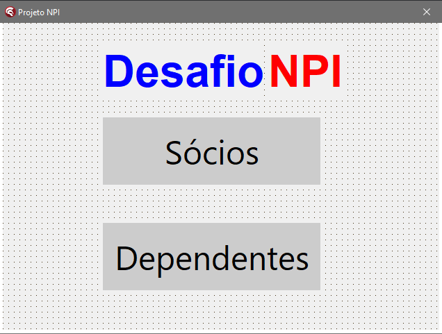
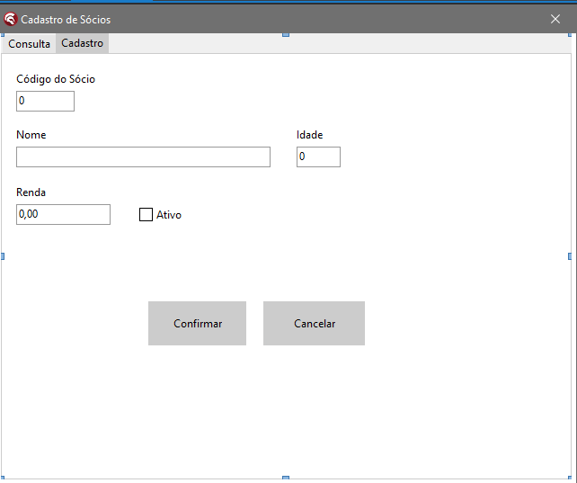

Projeto desenvolvido em Delphi utilizando SQL Server como banco de dados.

O projeto gira em torno de um sistema de cadastro de Sócios e Dependentes, com a possibilidade de criar um relatório básico.

Área onde é possível acessar os registros de Sócios e Dependentes.

Aqui é a área onde você terá acesso ao cadastro de sócios e dependentes. Além disso, nessa mesma tela, podemos encontrar o campo "consulta", onde é possível realizar consultas tanto de sócios quanto de dependentes.

Na seção de consulta, temos as opções de Incluir, Alterar, Excluir e Gerar Relatório.
